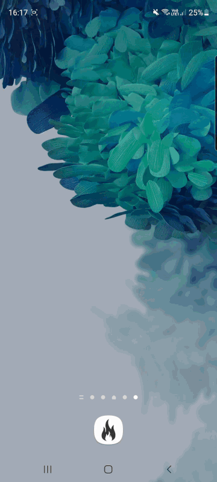

# :fire:  OSPapp  :fire:
Darmowa alikacja mobilna przeznaczona do użytku OSP. Powstała w celu usprawienia pracy strażaków. Umożliwia szybkie i przystępne wypełnianie oraz edycje raportów
z akcji za pomocą telefonu. Jest integralną częscią aplikacji desktopowej. :fire_engine:	

### Wizualizacja :iphone:

### Instalacja  :gear:

Połącz się z internetem na swoim urządzeniu mobilnym. Pobierz poniższy link, a następnie zatwierdź wszystkie pojawiające się isntrukcje.

[Kliknij aby zainstalować aplikację](https://drive.google.com/file/d/1dFipQw3_58IHhQqEm-oV0nlLrPWkyt-_/view?usp=sharing)

### Technologie :wrench:
Aplikacja powstała w Python 3.8 z użyciem bibliotek:
* Kivy 2.0.0
* KivyMD 0.104.2.dev()
* Pyrebase 3.0.27
* Buldoizer 1.2.0.dev()

### Geneza :bulb:
Aplikacja powstala jako podsumowanie przedmiotu Programowanie w języku Python na AGH UST.
Zapotrzebowanie na projekt zostało złożone przez jedną z jednostek OSP.

### Twórcy :keyboard:
 :firefighter:	[Anna Gut](https://github.com/aniagut)        
 :firefighter:	[Jakub Janicki](https://github.com/JanickiJ)  